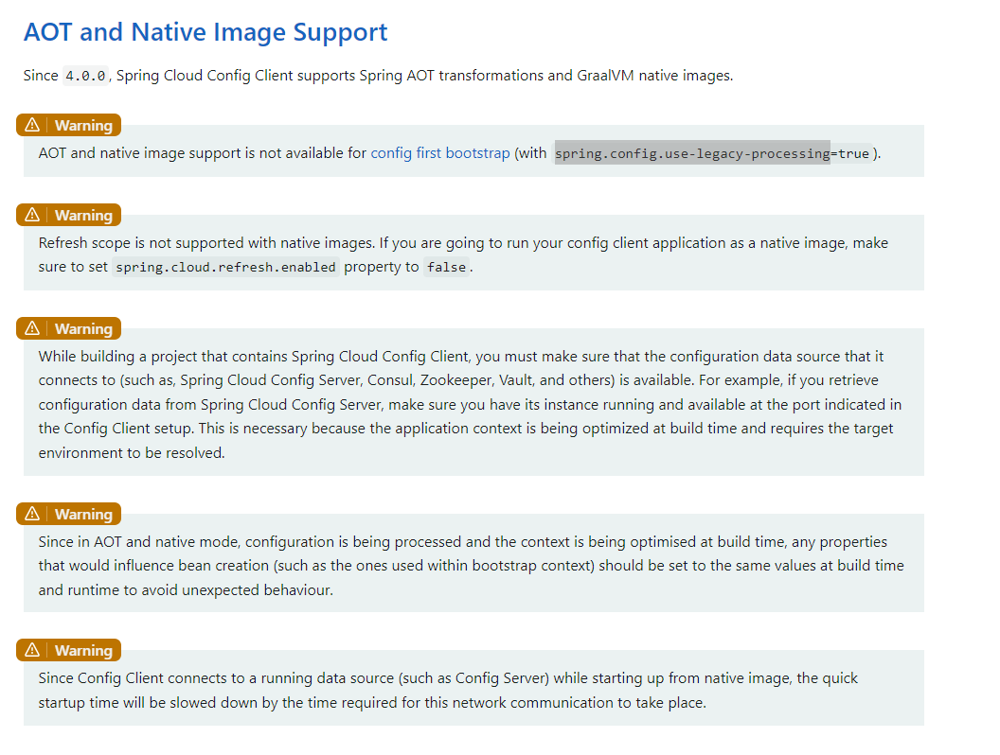

# 反射解决方式

https://stackoverflow.com/questions/76747716/how-to-register-method-for-runtime-reflection-with-graalvm

# 官方解决方式
https://www.graalvm.org/latest/reference-manual/native-image/guides/configure-with-tracing-agent/
https://www.graalvm.org/22.0/reference-manual/native-image/Agent/

# 编译配置
https://www.graalvm.org/latest/reference-manual/native-image/overview/BuildConfiguration/

I faced a similar issue today (spring-boot-3.1.2) and I could fix it by doing the following:

1. mvn -Pnative native:compile
2. java -Dspring.aot.enabled=true -agentlib:native-image-agent=config-output-dir=./config -jar target/<your-app.jar> (this will create a config folder in the root dir of your app)
3. try testing your application with all the possible paths covered so that reflection-config.json has all the information regarding the reflection calls at run time, once done use Ctrl+C to stop the app
4. create a folder META-INF/native-image in src/main/resources
5. copy all the contents here(META-INF/native-image) from config folder created in step 2 enter image description here
6. again run mvn -Pnative native:compile OR mvn -Pnative spring-boot:build-image (if you need docker image)
7. finally run target/your-app-name (or docker run...)

I hope this helps, however, I am a newbie as far as graalVM and spring boot native apps/images are concerned, trying to learn.

# maven 打包命令
`
mvn -Pnative -Pdev native:compile-no-fork -f pom.xml
`

# aot编译
`
java -Dspring.aot.enabled=true -agentlib:native-image-agent=config-output-dir=./config -jar target/spring-native-test-1.0.0-SNAPSHOT.jar
`

# aot springcloud 注意事项

# 编译配置
https://www.graalvm.org/jdk17/reference-manual/native-image/overview/BuildOptions/
